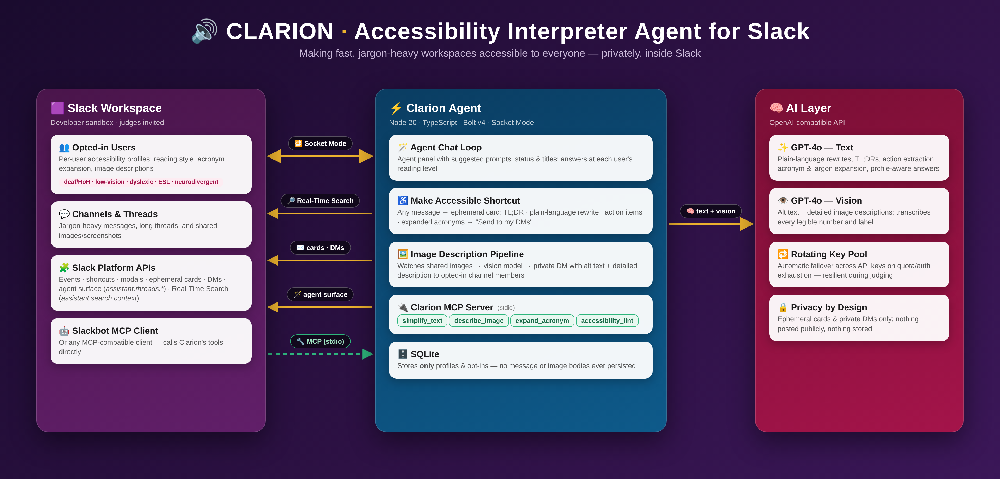

# Clarion

**Clarion** is a Slack-native accessibility agent that makes fast, jargon-heavy workspaces usable for deaf/HoH, low-vision, dyslexic, ESL, and neurodivergent workers — plain-language rewrites, private image descriptions, workspace-aware acronym expansion, and per-user accessibility profiles.

Built for the **Slack Agent Builder Challenge** (Slack Agent for Good track).

> **Status:** Fully built and **live-tested end-to-end in a real Slack Developer sandbox** (`clarion-hackathon.enterprise.slack.com`). The bot runs 24/7 on an always-on cloud VM via Socket Mode. See [`test-report.md`](test-report.md) for the full live verification results.

## Architecture

## Features

- **Agent chat loop**: Slack agent panel with welcome message + suggested prompts, thinking status + thread titles (`assistant.threads.*`), profile-aware replies, context-aware via `app_context_changed`.
- **Accessibility profiles**: Opt-in profile modal (reading style, acronym expansion, image descriptions) via `/clarion profile`. Stored in SQLite; every LLM response adapts to the user's profile.
- **Make Accessible** (demo centerpiece): Message shortcut on any message/thread. Fetches the full thread, then returns a private ephemeral Block Kit card with TL;DR / Plain-language rewrite / Action items / Terms expanded, plus a "Send to my DMs" button.
- **Workspace acronym expansion**: Uses Slack's **Real-Time Search** (`assistant.search.context` with `action_token` plumbing) for workspace-specific definitions with citations + permalinks, with a graceful general-knowledge fallback.
- **Private image descriptions**: On `file_share` in channels where the bot is invited, opted-in users (including the poster) get a private DM with concise alt text + a detailed vision description (GPT-4o vision) — nothing is posted publicly.
- **MCP server**: Standalone `npm run mcp` exposing 4 tools over stdio (`simplify_text`, `describe_image`, `expand_acronym`, `accessibility_lint`) reusing the core logic.

## Qualifying Slack technologies (all three)

1. **Slack agent surface / AI capabilities** — agent panel, suggested prompts, `assistant.threads.*`
2. **Real-Time Search API** — workspace-grounded acronym expansion (with graceful fallback; see limitations)
3. **MCP server integration** — four Clarion tools over stdio

## Tech

- **Bolt for JavaScript v4** + **Socket Mode** (no public URL)
- **GPT-4o** (text + vision) via an OpenAI-compatible API (OpenRouter), with automatic rotation across a pool of API keys on quota exhaustion
- **SQLite** (better-sqlite3) — only profiles + opt-ins
- **TypeScript** (strict)
- **MCP** via `@modelcontextprotocol/sdk`

No message bodies or images are ever stored (privacy by design).

## Live verification

All six test categories passed live in the sandbox (see [`test-report.md`](test-report.md)):

| Test | Result |
|---|---|
| Profile onboarding & persistence | PASS |
| Agent chat loop | PASS |
| Make Accessible + Send to my DMs | PASS |
| Acronym expansion | PASS (general-knowledge fallback; RTS grounding unverified in this sandbox — see limitations) |
| Private image descriptions | PASS |
| MCP tools over stdio | PASS |

Judges (`slackhack@salesforce.com`, `testing@devpost.com`) have been invited to the sandbox.

## Quick Start

1. Join the [Slack Developer Program](https://api.slack.com/developer-program) and provision a sandbox (Slack AI Search enabled for best RTS results).
2. Create an app **from manifest**: https://api.slack.com/apps → Create New App → From an app manifest → paste `manifest.yaml`.
3. Install to your sandbox workspace.
4. Copy tokens:
   - Bot User OAuth Token → `SLACK_BOT_TOKEN`
   - App-Level Token (connections:write) → `SLACK_APP_TOKEN`
5. Get an LLM key: either `OPENAI_API_KEY`, or an OpenRouter key with `OPENAI_BASE_URL=https://openrouter.ai/api/v1` (multiple keys supported via `OPENROUTER_API_KEYS`, comma-separated).
6. Copy `.env.example` → `.env` and fill.
7. `npm install`
8. `npm start` (or `npm run dev` for watch mode)
9. In Slack: open the Clarion agent from the top bar, or run `/clarion profile`, or use the "Make Accessible" message shortcut (invite the bot to the channel first).

Manual verification steps are in `TESTING.md`.

## Scripts

- `npm run dev` — watch mode (tsx)
- `npm run build`
- `npm start`
- `npm run typecheck`
- `npm run mcp` — start MCP server (for inspector or clients)

## Known Limitations (honest)

- Workspace-grounded RTS citations could not be verified in this sandbox (`assistant.search.context` returned `invalid_action_token`); the app degrades gracefully to general-knowledge definitions.
- Image descriptions require the bot to be invited to the channel.
- Image rate limiting is in-memory (process-local).
- MCP verified over stdio (not connected to the Slackbot MCP client).
- Daily digests / nudges / lint command were stretch features and are not in this build.

## Privacy & Compliance

- Opt-in only
- Dignity by default (ephemeral cards + private DMs — nothing posted publicly)
- No persistent storage of message content or images

## Docs

- [`test-report.md`](test-report.md) — live sandbox test results
- `TESTING.md` — manual verification checklists
- `DECISIONS.md`, `PLAN.md`, `architecture.md` — build notes
