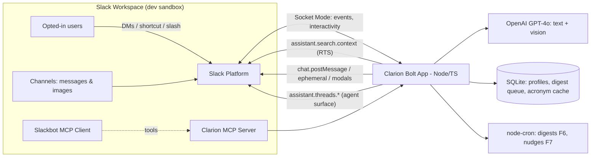

```mermaid
flowchart LR
  subgraph Slack["Slack Workspace (dev sandbox)"]
    U1[Opted-in users] -- DMs / shortcut / slash --> S[Slack Platform]
    CH[Channels: messages & images] --> S
    SB[Slackbot MCP Client] -. tools .-> MCP
  end
  S <-- Socket Mode: events, interactivity --> APP[Clarion Bolt App - Node/TS]
  APP -- assistant.search.context (RTS) --> S
  APP -- chat.postMessage / ephemeral / modals --> S
  APP -- assistant.threads.* (agent surface) --> S
  APP --> LLM[OpenAI GPT-4o: text + vision]
  APP --> DB[(SQLite: profiles, digest queue, acronym cache)]
  APP --> CRON[node-cron: digests F6, nudges F7]
  MCP[Clarion MCP Server] --> APP
```
