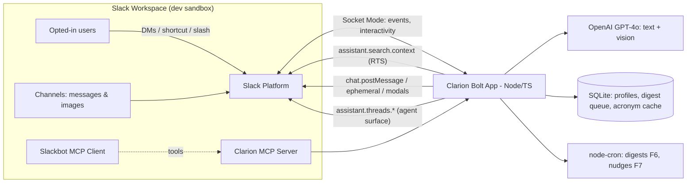

# CLARION — Accessibility Interpreter Agent for Slack
### Build Specification v1.0 — Slack Agent Builder Challenge ("Slack Agent for Good" track)

**Deadline: July 13, 2026 @ 5:00 PM PDT (~27h from spec time)**

---

## 1. Product Overview

### 1.1 One-liner
Clarion is a Slack-native accessibility agent that makes fast, jargon-heavy workspaces usable for deaf/HoH, low-vision, dyslexic, ESL, and neurodivergent workers — plain-language rewrites, image descriptions, workspace-aware acronym expansion, and cognitive-load-tuned digests.

### 1.2 Problem
- 1.3B people globally live with significant disability; knowledge work increasingly happens in real-time chat.
- Slack workspaces are hostile to many users: walls of jargon and acronyms, unlabeled screenshots, 200-message threads, and social pressure to keep up.
- Existing accessibility tooling stops at the OS/screen-reader layer; nothing interprets the *content* itself.

### 1.3 Why it wins the "Agent for Good" track
- Accessibility is the **first example listed** in the track description.
- Judging criteria mapping:
  - **Potential Impact**: every workspace has users who benefit; extends beyond disability to ESL workers and new hires.
  - **Quality of Idea**: no established competitor doing content-level accessibility in Slack.
  - **Technological Implementation**: uses ALL THREE qualifying technologies (Slack AI agent surface, RTS API, MCP server) — only 1 is required.
  - **Design**: opt-in profiles + non-intrusive DM delivery = thoughtful, respectful UX.

### 1.4 Hackathon compliance checklist
| Requirement | How Clarion satisfies it |
|---|---|
| Uses ≥1 of Slack AI / MCP / RTS | Uses all three |
| Fits ≥1 track | Slack Agent for Good |
| Text description w/ impact | §1.2–1.3 above, adapted |
| ~3-min demo video | Script in §10 |
| Architecture diagram | §5 (render with Excalidraw/Mermaid) |
| Sandbox URL + access for slackhack@salesforce.com, testing@devpost.com | §11 |

---

## 2. Personas & Use Cases

| Persona | Pain | Clarion feature |
|---|---|---|
| **Maya** — low-vision engineer | Screenshots of dashboards posted with no alt text | Auto image descriptions DM'd to her |
| **Devon** — dyslexic PM | Long dense threads exhausting to parse | "Make Accessible" message shortcut → TL;DR + plain-language rewrite |
| **Priya** — ESL data analyst | Idioms + company acronyms ("let's double-click on the NRR delta before EOD") | Jargon translation with **workspace-specific** acronym expansion via RTS |
| **Sam** — ADHD designer | Loses mentions in fast channels; anxiety about missing things | Daily "what you actually need" digest + unanswered-mention nudges |
| **Team lead** | Wants inclusive comms, doesn't know how | `/clarion check` — inclusivity lint of a draft message |

---

## 3. Feature Specification

### 3.1 MVP (must ship — hours 0–16)

**F1. Onboarding & Accessibility Profile**
- Agent DM (agent_view messaging experience). First open → welcome message + profile setup via Block Kit (static selects + checkboxes):
  - Reading preference: `plain language` / `bullet summaries` / `original`
  - Expand acronyms: on/off
  - Describe images: on/off
  - Digest: off / daily @ chosen hour
  - Nudge on unanswered mentions: on/off
- Stored in SQLite (`profiles` table). `/clarion profile` reopens the modal any time.
- Suggested prompts pinned at top of Messages tab (`assistant.threads.setSuggestedPrompts`):
  - "Simplify the last thread I was reading"
  - "What did I miss today?"
  - "What does <acronym> mean here?"

**F2. "Make Accessible" message shortcut** (core demo moment)
- Message shortcut (`message_action`) on any message/thread.
- Pipeline:
  1. Fetch message + thread via `conversations.replies`.
  2. LLM pass (GPT-4o via OpenAI API) with the user's profile as system-prompt parameters → produces: TL;DR (≤2 sentences), plain-language rewrite, action items, detected acronyms/jargon list.
  3. For each unknown acronym → **RTS API** (`assistant.search.context`, semantic query: `"What does {ACRONYM} stand for?"`) to find the workspace-specific meaning, with permalink citation to the defining message.
  4. Respond **ephemerally** in-channel (or DM, per profile) with a structured Block Kit card. Never posts publicly — dignity by design.

**F3. Workspace-aware acronym/jargon expansion**
- Also standalone: user DMs the agent "what does NRR mean here?" → RTS semantic search → answer + cited permalink.
- Fallback chain: RTS hit → general-knowledge LLM answer (clearly labeled "general meaning, not workspace-specific").

**F4. Image descriptions**
- Agent is invited to channels (`/invite @Clarion`). On `message` events with image files (`file_share`), for each opted-in member of that channel:
  - Download image (`files:read`), send to GPT-4o vision → concise alt-text + detailed description (data in charts, text in screenshots).
  - DM the description with permalink to the original message.
- Rate guard: max 20 images/hour/workspace; skip images >5 MB.

**F5. Agent chat loop (Slack AI surface)**
- `agent_view` enabled; events: `app_home_opened`, `app_context_changed`, `message.im`.
- `assistant.threads.setStatus` loading states; `assistant.threads.setTitle` per conversation.
- Context-aware: `app_context_changed` gives the channel the user is viewing → "summarize this channel for me" works without naming it.
- General Q&A grounded via RTS: user question → `assistant.search.context` → top results as LLM context → cited answer, rendered at reading level from the user's profile.

### 3.2 Stretch (hours 16–22, cut without mercy if behind)

**F6. Daily digest** — cron (node-cron): for each digest-enabled user, RTS query for their mentions + active channels over 24h → LLM digest tuned to profile (e.g. max 5 bullets for low-cognitive-load) → DM.

**F7. Unanswered-mention nudge** — hourly scan: mentions of opted-in users with no reply/reaction from them after N hours → gentle DM nudge with permalink.

**F8. `/clarion check` inclusivity lint** — user pastes a draft; LLM flags idioms, ableist phrasing, undefined acronyms, wall-of-text; suggests a rewrite. Ephemeral.

### 3.3 Explicitly out of scope (say so in submission — shows judgment)
- Huddle live-captioning (no public API for huddle audio).
- Marketplace listing (Organizations track requirements not met in timeframe; also `search:read.*` scope restrictions).
- Voice output / TTS.
- Persistent storage of message content (privacy: we process and discard; only profiles + minimal event metadata stored).

---

## 4. Technical Architecture

### 4.1 Stack
| Layer | Choice | Rationale |
|---|---|---|
| Framework | **Bolt for JavaScript (v4) + TypeScript**, Socket Mode | Fastest path; Socket Mode = no public URL needed for sandbox judging |
| Runtime | Node 20 | |
| LLM | OpenAI GPT-4o (`chat.completions`, vision) | One model for text + vision; ship fast |
| MCP server | Node `@modelcontextprotocol/sdk`, stdio/HTTP | Exposes Clarion tools (below) |
| DB | SQLite via `better-sqlite3` | Zero-ops; profiles + digest queue only |
| Scheduler | `node-cron` in-process | Digest + nudge jobs |
| Hosting | Local `slack run` for dev; small VM/Render/Fly.io for the judging window | Socket Mode means judges just use the sandbox |

### 4.2 Slack app manifest (key sections)
```yaml
display_information:
  name: Clarion
  description: Accessibility interpreter — plain language, image descriptions, and jargon translation for every Slack workspace.
features:
  agent_view:
    enabled: true
    agent_description: >
      I make this workspace accessible: I simplify threads, describe images,
      expand acronyms with workspace context, and send digests tuned to how you read.
  bot_user:
    display_name: Clarion
    always_online: true
  shortcuts:
    - name: Make Accessible
      type: message
      callback_id: make_accessible
      description: Simplify, summarize, and translate this message
  slash_commands:
    - command: /clarion
      description: profile | check | digest
oauth_config:
  scopes:
    bot:
      - assistant:write        # agent surface
      - chat:write             # respond
      - commands               # /clarion
      - im:history             # agent DMs
      - channels:history       # threads + image events (public)
      - groups:history         # private channels the bot is invited to
      - files:read             # download images for description
      - search:read.public     # RTS: public messages
      - search:read.files      # RTS: files
      - search:read.users      # RTS: user lookup
      - users:read             # profile display names
      - reactions:read         # nudge feature (has the user reacted?)
settings:
  event_subscriptions:
    bot_events:
      - app_home_opened
      - app_context_changed
      - message.im
      - message.channels
      - message.groups
  interactivity:
    is_enabled: true
  socket_mode_enabled: true
```
Note on RTS auth: bot-token RTS calls require the `action_token` from `message.im` / `app_mention` / channel message events — capture and pass it per-request. Features not driven by a message event (digest F6) need a **user token** (`xoxp-`) from a per-user OAuth grant; for the hackathon, seed it for the demo users via the sandbox OAuth flow, and note this in the architecture writeup.

### 4.3 Module layout
```
clarion/
├── src/
│   ├── app.ts                 # Bolt init, Socket Mode, listener registration
│   ├── listeners/
│   │   ├── agent.ts           # app_home_opened, message.im, app_context_changed loop
│   │   ├── shortcuts.ts       # make_accessible
│   │   ├── commands.ts        # /clarion profile|check|digest
│   │   ├── events.ts          # channel messages → image pipeline, mention tracking
│   │   └── actions.ts         # Block Kit interactions (profile modal, buttons)
│   ├── core/
│   │   ├── llm.ts             # OpenAI wrappers: simplify(), describeImage(), digest(), lint()
│   │   ├── rts.ts             # assistant.search.context wrapper + action_token plumbing
│   │   ├── profiles.ts        # SQLite profile CRUD
│   │   ├── acronyms.ts        # RTS → LLM fallback chain, in-memory cache
│   │   └── digests.ts         # cron jobs F6/F7
│   ├── blocks/                # Block Kit builders (welcome, card, modal, digest)
│   └── mcp/
│       └── server.ts          # MCP server exposing tools
├── manifest.yaml
├── architecture.md            # diagram source (Mermaid)
└── README.md
```

### 4.4 MCP server (qualifying tech #3)
Clarion ships an MCP server (`clarion-mcp`) so any MCP client (Slackbot MCP Client, Claude, Cursor) can use its accessibility engine:
- `simplify_text(text, reading_profile)` → plain-language rewrite
- `describe_image(url)` → alt text + detailed description
- `expand_acronym(term, workspace_context?)` → definition + source
- `accessibility_lint(text)` → issues + suggested rewrite
Demo moment: connect `clarion-mcp` to the **Slackbot MCP Client** in the sandbox so Slackbot itself can call Clarion tools — a tight "MCP inside Slack" story.

### 4.5 Key pipelines (pseudocode)

**Make Accessible (F2):**
```
shortcut('make_accessible') →
  ack(); openLoadingModal()
  thread = conversations.replies(channel, message_ts)
  profile = profiles.get(user_id)
  out = llm.simplify(thread, profile)         # {tldr, rewrite, actions[], jargon[]}
  for term in out.jargon:
      hit = rts.search(`What does ${term} stand for?`, action_token?)
      defs[term] = hit ? {text, permalink} : llm.generalDefine(term)
  respond(ephemeral BlockKit card: tldr / rewrite / actions / jargon table w/ links)
```

**Image description (F4):**
```
event('message', subtype=file_share) →
  optedIn = profiles.imageUsersInChannel(channel)
  if !optedIn.length: return
  desc = llm.describeImage(await files.download(file))
  for u in optedIn: chat.postMessage(dm(u), blocks(altText, detail, permalink))
```

**Grounded Q&A in agent thread (F5):**
```
event('message.im') →
  setStatus('reading the workspace…')
  results = rts.search(user_text, event.action_token)   # semantic if question-shaped
  answer = llm.answer(user_text, results, profile)      # citations required
  chat.postMessage(thread_ts, blocks(answer, cited permalinks))
```

---

## 5. Architecture Diagram (submission asset — render in Excalidraw or Mermaid → PNG)



---

## 6. UX Specification

### 6.1 Design principles
- **Dignity by default**: all outputs ephemeral or DM'd — coworkers never see who uses accessibility help.
- **Opt-in only**: no message is processed for a user who hasn't enabled a feature.
- **Cited, never confident-wrong**: workspace answers always link the source message; general-knowledge fallbacks are labeled.
- **Accessible about accessibility**: all Block Kit output uses semantic structure, ≤3 sections/card, emoji only as leading status indicators, plain-text fallback set on every message (screen-reader friendly).

### 6.2 Key Block Kit surfaces
1. **Welcome/profile card** — header, radio/checkbox groups, "Save profile" button.
2. **Accessible view card** — `🔍 TL;DR` / `✏️ Plain version` / `✅ Actions` / `📖 Terms` sections; "Send to my DMs" button.
3. **Image description DM** — context (who posted, where, permalink) + short alt + expandable detail.
4. **Digest DM** — max 5 bullets, each with permalink; "That's all — nothing else needs you." closing line (anxiety-reducing).

---

## 7. Data & Privacy
- Store: user profiles, digest schedule, acronym cache (term → definition + permalink), pending-nudge metadata (channel, ts). 
- **Never store message bodies or images**; processed in-memory and discarded.
- OpenAI calls: no training on API data (default); state this in the submission.
- Fail-closed: missing env keys → app refuses to start.

## 8. Environment & Secrets
```
SLACK_BOT_TOKEN=xoxb-…      SLACK_APP_TOKEN=xapp-…   (Socket Mode)
SLACK_USER_TOKEN=xoxp-…     (demo user, for digest RTS)
OPENAI_API_KEY=sk-…
```

---

## 9. Build Plan (27h, aggressive)

| Hours | Milestone |
|---|---|
| 0–1 | Slack Dev Program sandbox, create app from manifest, `slack run` hello-world agent loop |
| 1–4 | F5 agent loop: events, setStatus/setTitle, suggested prompts, OpenAI wired |
| 4–7 | F1 profiles: SQLite, modal, /clarion profile |
| 7–11 | F2 Make Accessible shortcut end-to-end (LLM simplify + Block Kit card) |
| 11–13 | F3 RTS integration: action_token plumbing, acronym pipeline + citations |
| 13–16 | F4 image descriptions (vision + DM fan-out) |
| 16–18 | MCP server + Slackbot MCP Client connection |
| 18–20 | Stretch: F6 digest (only if on schedule; else skip to polish) |
| 20–22 | Seed sandbox with realistic demo data (channels, jargon, screenshots); invite judges' emails |
| 22–24 | Record + edit 3-min demo video (script §10) |
| 24–26 | Architecture diagram PNG, Devpost writeup, submission form |
| 26–27 | Buffer / final submission ≥1h before deadline |

**Cut order if behind:** F7 → F8 → F6 → MCP server (keep RTS + agent surface; still satisfies tech requirement).

---

## 10. Demo Video Script (~3 min)

1. **0:00–0:20 Hook**: "1.3 billion people live with a disability. Modern work happens in Slack — fast, jargon-heavy, image-filled. Meet Clarion." Show a chaotic channel: acronym soup + an unlabeled dashboard screenshot.
2. **0:20–0:50 Onboarding**: open Clarion from the agent top bar, set profile (plain language, describe images, daily digest).
3. **0:50–1:30 Make Accessible**: right-click the dense thread → shortcut → ephemeral card: TL;DR, plain rewrite, actions, and "NRR = Net Revenue Retention — defined by @Sarah in #finance (link)" ← *emphasize RTS workspace citation on screen*.
4. **1:30–2:00 Image description**: teammate posts a chart screenshot → Maya's DM receives full description including the numbers. Voiceover: "For low-vision users, images stop being dead ends."
5. **2:00–2:25 Grounded Q&A + digest**: ask Clarion "what did I miss today?" → cited, profile-tuned digest.
6. **2:25–2:45 MCP**: Slackbot invoking `clarion-mcp` `simplify_text` — "Clarion's engine is an MCP server any agent can use."
7. **2:45–3:00 Close**: architecture diagram flash + impact line: "Accessibility isn't a feature request. Clarion makes every workspace one where everyone can keep up."

---

## 11. Submission Checklist (Devpost)
- [ ] Project name **Clarion**, track: **Slack Agent for Good**
- [ ] Text description: problem → features → impact → tech (all 3 qualifying technologies)
- [ ] 3-min video (YouTube unlisted)
- [ ] Architecture diagram image
- [ ] Sandbox URL; invite **slackhack@salesforce.com** and **testing@devpost.com** as members
- [ ] Seeded demo data + Clarion running/hosted through the judging window
- [ ] README in repo: setup, env vars, manifest

## 12. Risks
| Risk | Mitigation |
|---|---|
| Sandbox lacks Slack AI Search (semantic RTS) | Keyword RTS still works; request AI-Search sandbox from Dev Program early (hour 0); demo works either way |
| RTS `action_token` friction for non-event flows | Use demo-user `xoxp` token for digest; document honestly |
| Vision misdescribes charts | Prompt for "describe only what is visible; state uncertainty"; pick clean demo screenshots |
| Time overrun | Cut order in §9; MVP alone (F1–F5) is a complete, winning story |
| Hosting flakes during judging | Socket Mode on a small VM + `forever/pm2`; test from a second machine |
